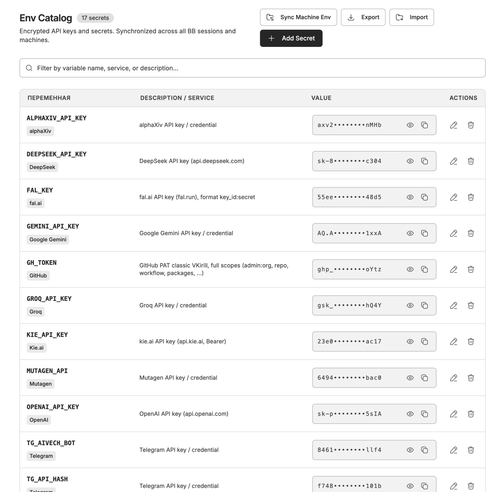

# Env Catalog for BB

**Unified encrypted catalog of API keys and environment variables across all BB sessions and machines.**



## Why Env Catalog?

In BB, multiple agents and machines often need access to the same API keys (e.g. OpenAI, Anthropic, Tavily, Stripe, database URLs).
Instead of repeatedly asking the user for credentials or keeping unencrypted keys scattered in temporary files, **Env Catalog** provides:

1. **Centralized & Encrypted Storage:** Stored in SQLite on the BB primary server, encrypted at rest using AES-256-GCM.
2. **Instant Multi-Machine Access:** Sessions running on any enrolled machine (Mac, Linux, cloud) query the server via native Agent Tools or the `bb env-catalog` CLI.
3. **Token-Efficient Agent Integration:** The agent is instructed automatically on each session to check the catalog before asking for keys, and to store newly provided keys automatically. Keys are listed without values to save context tokens.
4. **Visual Management UI:** A full-featured page in BB's navigation sidebar to view, search, unmask, copy, edit, add, or bulk import/export `.env` files.

---

## Agent Capabilities

When the plugin is enabled, all BB agents automatically receive:
- **System Instructions:** Reminding the agent to check `env_list` / `env_get` when credentials are required, to use `env_request` when a key is missing instead of asking in chat, and to persist new credentials via `env_set`.
- **`env_request`:** Prompts the user with a secure masked in-app modal in the thread to input sensitive API keys. Values are encrypted directly into the catalog and never leak into the chat transcript.
- **`env_list`:** Lists all variable names, services, and descriptions (masked values).
- **`env_get`:** Retrieves the decrypted value of a specific secret by name.
- **`env_set`:** Stores or updates an API key with optional service tags and description.
- **`env_delete`:** Deletes a secret from the catalog.

---

## CLI Commands

You or your scripts can interact with the catalog directly from any terminal:

```bash
# Securely request credentials via masked modal in thread
bb env-catalog request OPENAI_API_KEY --purpose "Configure server" --describe OPENAI_API_KEY "OpenAI key"

# List all stored secrets (masked)
bb env-catalog list

# Get a decrypted secret value
bb env-catalog get OPENAI_API_KEY --raw

# Store or update a secret
bb env-catalog set OPENAI_API_KEY sk-proj-... --service OpenAI --desc "Primary OpenAI key"

# Delete a secret
bb env-catalog delete OBSOLETE_KEY

# Export all secrets to .env format
bb env-catalog export --format env > .env.local
```

---

## Web UI

Open **Env Catalog** from the BB left navigation sidebar:
- **Search & Filter:** Find any key by name, service, or note.
- **Masked by Default:** Values show as `sk-p••••••••1a2b`. Click the eye icon to unmask or the copy icon to copy directly.
- **Add / Edit Modal:** Quickly add new keys with custom service labels.
- **Import / Export:** Paste an entire `.env` file to bulk-import keys, or export to `.env` with a single click.

---

## License

MIT
