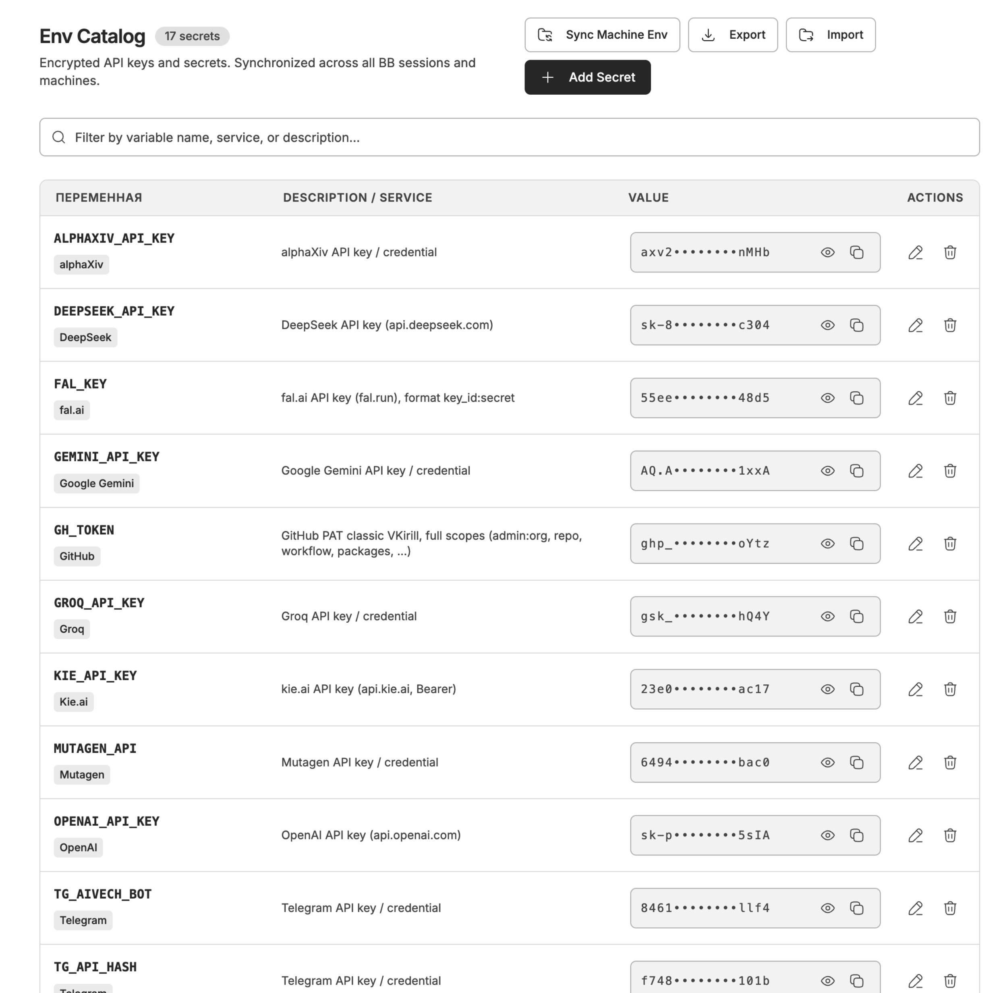

# Env Catalog for BB



Env Catalog is a BB plugin for storing API keys, FTP/SFTP access, SSH credentials, and site logins in one encrypted catalog. BB agents, the plugin page, and the `bb env-catalog` command group access the catalog.

The plugin includes a credential management page and a masked in-thread form for requested credentials. See [Overview](docs/overview.md) and [Features](docs/features/agent-access.md) for how they work.

## Quick start for contributors

```bash
npm ci
npm run check
```

The repository build uses the BB plugin CLI. Install and configure the plugin through the BB plugin manager; this repository does not define a separate install script. See [Deployment](docs/deployment.md).

## Documentation

- [Architecture](docs/architecture.md)
- [Capabilities](docs/features/agent-access.md), [credential requests](docs/features/secure-requests.md), [catalog management](docs/features/catalog-management.md), and [import/export](docs/features/import-export.md)
- [RPC, agent tools, and CLI](docs/api.md)
- [Data model](docs/data-model.md)
- [Gotchas](docs/gotchas.md) and [decisions](docs/decisions.md)

## License

MIT. See [LICENSE](LICENSE).
