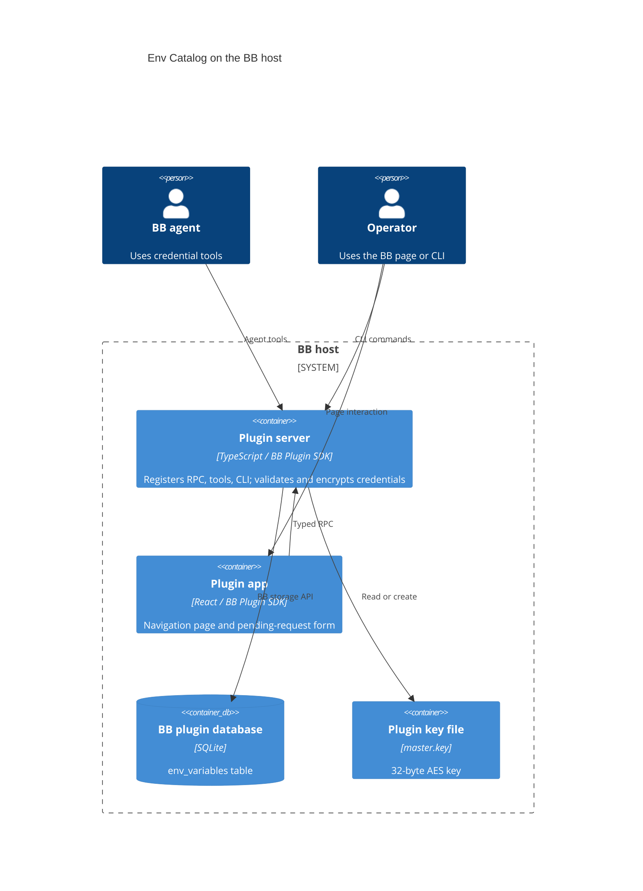

# Env Catalog Architecture

TL;DR: The BB host loads a server module that owns RPC, agent tools, CLI commands, encryption, and SQLite; a React plugin app calls the RPC contract and subscribes to catalog-change events (`server.ts:152-212`, `server.ts:562-599`, `app.tsx:1030-1041`).

## Parts and connections

The server initializes a plugin-specific directory under `experimental_dataDir` or `~/.bb`, creates or loads `master.key`, and obtains its database through `bb.storage.database()` (`server.ts:155-173`, `server.ts:199-212`).

The UI registers a navigation slot and a pending-interaction renderer; both use BB app APIs (`app.tsx:1030-1041`). The UI calls the same `rpcContract` that the server registers (`server.ts:56-128`, `server.ts:562-599`, `app.tsx:366-394`).

## Building blocks

- **Plugin server** — data access, AES-256-GCM encryption, schema migration, seven RPC handlers, five agent tools, and the CLI command group (`server.ts:152-212`, `server.ts:562-959`, `server.ts:1046-1087`).
- **Plugin app** — catalog navigation page, credential forms, and request-interaction renderer (`app.tsx:408-892`, `app.tsx:894-1028`, `app.tsx:1030-1041`).
- **Shared contracts** — the RPC contract and request/response validation schemas (`contracts.ts:4-70`, `server.ts:56-128`).
- **Credential model** — kind validation, structured access schemas, packing, masking, and display transforms (`kinds.ts:3-42`, `kinds.ts:57-78`, `kinds.ts:150-220`).

## Key flows

### Catalog read

The app calls `env_list`; the server queries SQLite and returns masked summaries. On reveal or edit, the app calls `env_get_value`; the server decrypts the stored value and returns either a secret string or structured access (`app.tsx:377-394`, `app.tsx:444-453`, `app.tsx:489-506`, `server.ts:244-308`, `server.ts:562-580`).

### Credential save

The RPC handler calls `saveVariable`, which normalizes the name, packs and validates kind-specific data, encrypts the packed string, writes the row, and publishes `env-catalog:changed`; the app listens for that event and reloads summaries (`server.ts:311-353`, `server.ts:582-585`, `app.tsx:388-394`).

### Secure request

`env_request` asks BB to render a pending interaction. The app validates the payload, collects masked credential fields, validates the response, and submits it. The server persists each entry via `saveVariable` (`server.ts:786-859`, `server.ts:861-959`, `app.tsx:894-1008`). See [Secure requests](features/secure-requests.md).

### `EnvCatalogPage`

`EnvCatalogPage` owns the catalog page's modal and action state while `useEnvCatalog` supplies RPC, list data, refetching, and error reporting (`app.tsx:366-394`, `app.tsx:408-424`).

1. Machine-environment import sets its pending flag, calls `env_import_machine_env`, and refetches on success; an RPC error is reported and the pending flag is reset in `finally` (`app.tsx:426-436`).
2. Add resets the edit marker and form to blank defaults. Edit fetches the full named record, converts it into form state, and opens the same modal; errors are reported without opening it (`app.tsx:438-453`).
3. Save returns before setting pending state or calling `env_save` when the trimmed name is empty. Otherwise it marks the form pending and sends `env_save`, using `value` for `secret` and `access` for structured kinds (`app.tsx:455-469`).
4. A successful save closes the modal and refetches the list. A failed save is reported, and the pending flag is always cleared (`app.tsx:470-477`).

| Branch | Condition | Outcome / failure |
|---|---|---|
| Add | Operator opens add. | Clears edit name and starts a blank form (`app.tsx:438-442`). |
| Edit | Operator selects a named row. | Fetches full value/access then populates form; lookup failure is reported (`app.tsx:444-453`). |
| Save | Name trims to non-empty. | Saves selected kind; success closes and refreshes, RPC failure is reported (`app.tsx:455-477`). |
| Empty-name save | Name trims to empty. | The Save button is disabled; if the handler runs, it returns before setting pending state or calling `env_save` (`app.tsx:455-469`, `app.tsx:802-805`). |
| Machine import | Operator triggers sync. | Refreshes after success; on failure reports the error and clears its pending state (`app.tsx:426-436`). |

### `EnvCatalogRequestInteraction`

This renderer validates pending-interaction payloads and creates form state once per requested field. Missing kind defaults to `secret`; malformed payloads render an error with a dismiss action (`app.tsx:894-928`).

1. On submit, it clears the previous error and walks requested fields. Missing form state stops submission with a required-value error (`app.tsx:930-939`).
2. For `secret`, it trims the entered value and stops on empty input or a value above `MAX_SECRET_BYTES`; valid values become secret entries (`app.tsx:940-951`).
3. For FTP, SSH, or login, it converts the form fields into structured access and appends an entry (`app.tsx:952-971`).
4. It validates the assembled entries against `envRequestResponseSchema`. Invalid response data shows a validation error without calling `submit` (`app.tsx:973-977`).
5. Valid data sets the busy state and calls BB's `submit`; rejection becomes a visible form error, and `finally` clears busy (`app.tsx:978-985`).

| Mode / condition | Result |
|---|---|
| Invalid pending payload | Shows `requestInvalid`; dismiss calls `cancel`, swallowing cancellation errors (`app.tsx:917-926`). |
| Secret field | Requires non-empty trimmed text no larger than the byte limit; otherwise shows a field error and returns (`app.tsx:940-950`). |
| Structured field | Converts kind-specific form data and relies on response schema validation before submit (`app.tsx:952-977`). |
| Submit rejected | Displays the thrown message and clears busy state (`app.tsx:978-985`). |

### `plugin` startup

1. Logs startup, chooses `bb.server.experimental_dataDir` or falls back to `$HOME/.bb` (and `~/.bb` if `HOME` is unset), then creates `plugins/env-catalog` recursively (`server.ts:152-160`).
2. Reads `master.key` if present. A 32-byte key is reused; a key of another length is replaced with 32 random bytes. If absent, a random 32-byte key is created. New writes request mode `0600` (`server.ts:162-173`).
3. Obtains the database through `bb.storage.database()` and migrates in the `env_variables` table and service index (`server.ts:199-212`).
4. Checks the migrated columns and adds `kind TEXT NOT NULL DEFAULT 'secret'` only when the column is missing (`server.ts:214-221`).

| Startup condition | Outcome / failure |
|---|---|
| `experimental_dataDir` is set | Uses that path as the BB data directory (`server.ts:155-159`). |
| Key absent or wrong length | Generates and writes a replacement key; an existing encrypted catalog then has no matching key if the old key was wrong length (`server.ts:162-172`). |
| Key is exactly 32 bytes | Loads and reuses it (`server.ts:162-169`). |
| Database lacks `kind` | Adds the column with legacy rows defaulted to `secret` (`server.ts:214-221`). |
| Directory, key-file, storage, or migration operation throws | Startup code has no local catch around these operations, so the error escapes plugin initialization (`server.ts:152-221`). |

## Invariants

- `name` is the table primary key, so one row exists per name; replacement preserves the original creation timestamp (`server.ts:202-210`, `server.ts:327-350`).
- The server and app share the RPC contract type and request schemas (`server.ts:56-128`, `app.tsx:9-14`).
- Realtime notifications cause the app to fetch the summary list again (`server.ts:130`, `server.ts:352-362`, `app.tsx:388-394`).

## Cross-cutting concerns

**Encryption:** values use AES-256-GCM with a random 12-byte IV and stored authentication tag; the master key is a separate file (`server.ts:162-196`). See [Data model](data-model.md).

**Authorization:** RPC, app slots, agent tools, and CLI register through BB Plugin SDK. This plugin source contains no credential-specific user or role check (`server.ts:562-599`, `server.ts:601-959`, `server.ts:1046-1087`).

**Failures:** RPC or CLI errors propagate from validation and storage operations; the UI catches request errors and places the message in page state (`app.tsx:373-375`, `app.tsx:455-477`). A declined secure request returns a cancelled result without saving (`server.ts:942-949`).

<!-- lane-pilot:backlinks -->
## Referenced by

- [Env Catalog Overview](overview.md)
