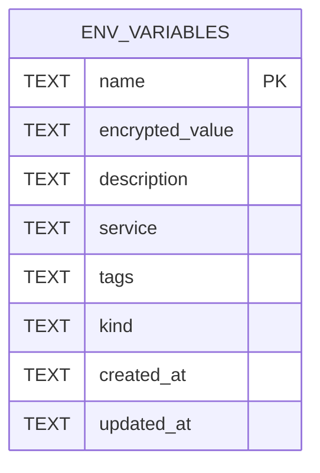

# Env Catalog Data Model

TL;DR: The plugin owns one SQLite table keyed by credential name. Metadata is stored in columns; credential values and structured access are packed, then encrypted into `encrypted_value` (`server.ts:199-230`, `server.ts:311-350`, `kinds.ts:57-78`).

## Schema overview

The table has one primary key and one secondary index on `service`; the code defines no foreign keys or related tables (`server.ts:202-221`).

## Tables

### `env_variables`

Stores one credential per name. `saveVariable` performs `INSERT OR REPLACE`; it preserves an existing creation timestamp and updates the remaining record values and `updated_at` (`server.ts:311-350`).

| Field | Key / nullability | Meaning |
|---|---|---|
| `name` | Primary key, non-null | Caller-supplied credential identifier; trimmed before save. Secure request forms constrain it to environment-variable syntax; ordinary save does not (`server.ts:321-323`, `contracts.ts:4-12`). |
| `encrypted_value` | Non-null | Base64 text arranged as `IV:authentication-tag:ciphertext`. Decrypted content is either the plain secret or JSON packing structured `kind` and `access` (`server.ts:175-196`, `kinds.ts:57-78`). |
| `description` | Nullable | Optional operator note; trimmed, with empty strings stored as SQL `NULL` (`server.ts:341-350`). |
| `service` | Nullable; indexed | Optional service label; if absent, a name/kind heuristic supplies a label for recognized names (`server.ts:132-150`, `server.ts:341-350`, `server.ts:211`). |
| `tags` | Nullable | Optional string array serialized as JSON text; malformed JSON reads as no tags (`server.ts:234-242`, `server.ts:325-326`). |
| `kind` | Non-null; default `secret` | `secret`, `ftp`, `ssh`, or `login`; an upgrade adds this column with `secret` for older rows (`kinds.ts:3-6`, `server.ts:214-221`). |
| `created_at` | Non-null | ISO timestamp assigned on first save; replacement preserves the prior value (`server.ts:320-334`). |
| `updated_at` | Non-null | ISO timestamp assigned on each save (`server.ts:320-350`). |

### Key and encrypted payload

The AES-256 key is stored outside SQLite as `master.key` in the plugin storage directory. The file is created with mode `0600`; encryption uses a random 12-byte IV and stores the authentication tag alongside the ciphertext (`server.ts:155-196`).

Structured payloads include version `1`, kind, and validated access fields; plain secrets remain the decrypted text (`kinds.ts:44-78`). FTP, SSH, and login field meanings and limits are defined in [Credential Catalog Management](features/catalog-management.md#credential-modes).

## Lifecycle

The table has no status-like column. Credential lifecycle is create/replace, read, delete:

| From | To | Function | When |
|---|---|---|---|
| Absent | Present | `saveVariable` (`server.ts:311-350`) | UI, agent tool, CLI, import, request, or machine-environment migration saves a name. |
| Present | Present | `saveVariable` (`server.ts:327-350`) | A save uses the same name; the row is replaced and `created_at` is preserved. |
| Present | Absent | `deleteVariable` (`server.ts:355-363`) | UI, agent tool, or CLI deletes that name. |

## Invariants

- `name` is unique because it is the primary key (`server.ts:202-210`).
- Credential values are encrypted before insertion; descriptions, service labels, tags, kind, and timestamps remain separate metadata columns (`server.ts:311-350`).
- The `idx_env_service` index supports service metadata lookups; no cleanup or retention job is defined in this plugin (`server.ts:202-212`, full plugin lifecycle `server.ts:152-1268`).

## Readers and writers

| Use case | Writes | Reads |
|---|---|---|
| UI list, reveal, edit, save, delete | `env_save`, `env_delete` handlers | `env_list`, `env_get_value` handlers (`server.ts:562-599`) |
| Agent tools | `env_set`, `env_delete`, completed `env_request` | `env_list`, `env_get` (`server.ts:601-959`) |
| CLI | `set`, `delete`, completed `request`, machine import | `list`, `get`, `export` (`server.ts:1046-1258`) |
| File import/export | `importContent` writes records; export is read-only | `env_variables` rows (`server.ts:366-491`) |
| BB Machine Environment migration | Imports decrypted source records into this table | BB `app_settings_values` source rows, read-only (`server.ts:493-559`) |

No retention schedule, expiration field, or cleanup job appears in this plugin's code (`server.ts:199-212`, `server.ts:1265-1268`). See [Gotchas](gotchas.md) for key-file replacement and export handling.

<!-- lane-pilot:backlinks -->
## Referenced by

- [Env Catalog Architecture](architecture.md)
- [Credential Import and Export](features/import-export.md)
- [Env Catalog Overview](overview.md)
